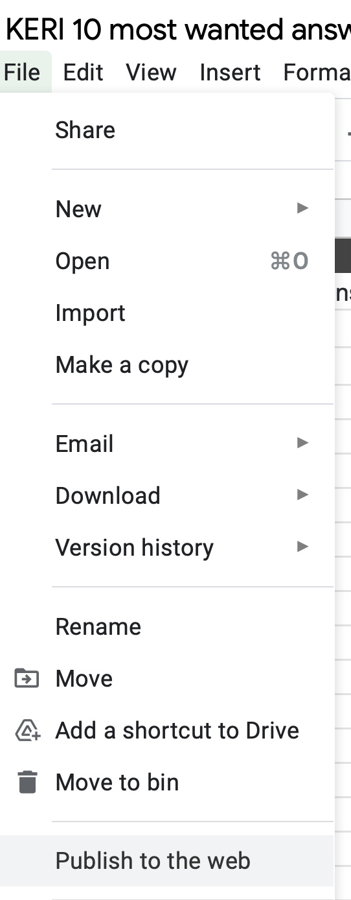
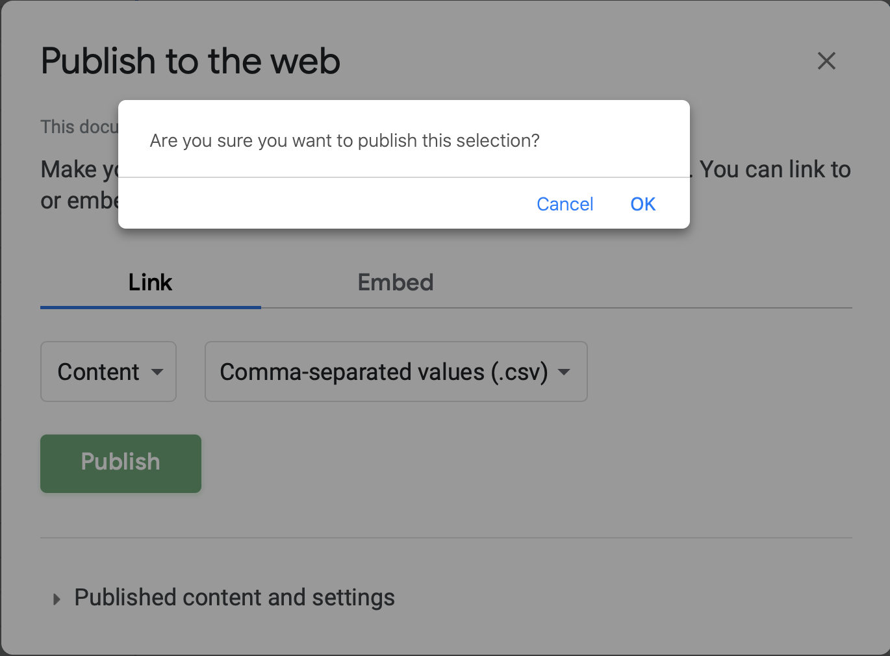
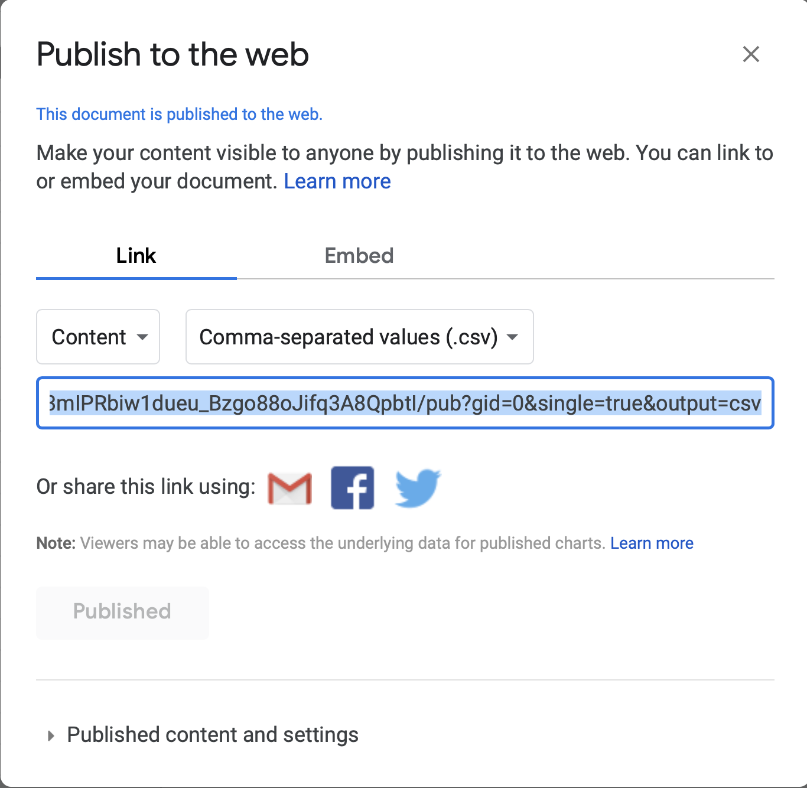

## Accordeone
This repo makes it possible to supply made-easy text of complex text in a fold-out accordeon.

## Steps
1. Copy the Google sheet
2. Empty cells
3. Row 2 contains the short and long description of the accordeon
4. Put in some test data
5. Publish the content of one tab to a csv file and copy the link provided to the file `faq.publish.php`
    * Publish to weg menu item under File
    * Setting of the publishing
    * OK to commit the setting of the publishing
    * Copy the url

Result:
```
https://docs.google.com/spreadsheets/d/e/2PACX-1vTPU9zK7WzRdtx58zhdMFrHKVmWxfG-2Y6dz68QDcP-Q8H3mIPRbiw1dueu_Bzgo88oJifq3A8QpbtI/pub?gid=0&single=true&output=csv
```







